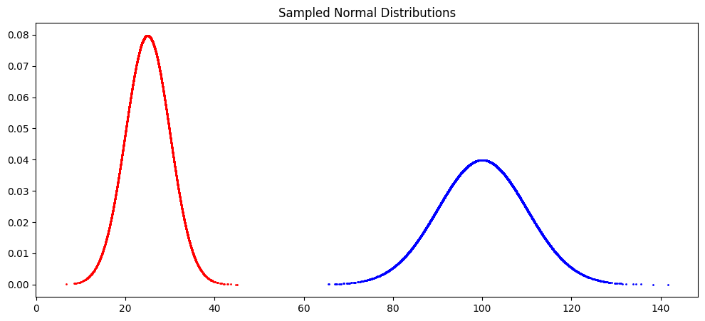
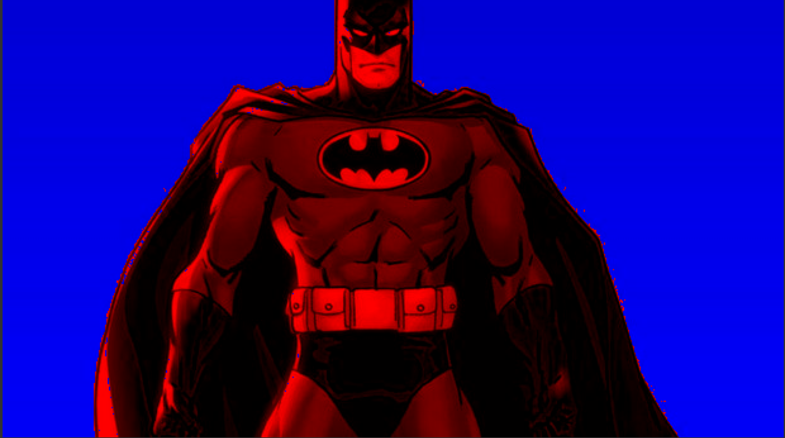

# Dependencies

Dependencies for both parts of the task are included in a single "requirements.txt" file in the root of the project. The first part of this assignment was implemented in Jupyter Notebook, so to access the results or to rerun the solution you might need to install Jupyter and corresponding extensions for your IDE if required. 

# Part 1

The solution for this part was implemented in Jupyter Notebook "main.ipynb" that is located in OptimalTransport folder.

## Part 1.1: Optimal Transport in 1D

The objective of this part was to implement Optimal Transport in a simple 1D case, more precisely calculate interpolation between two Gaussian distributions. 

#### Sampled distributions:
 


#### Comparison between closed-form solution and optimal transport of sampled distributions

For **n = 10000**: 

```
Closed form optimal transport:  5650
Approximate optimal transport with 10000 samples:  5657.02205355342
```
<div style="page-break-after: always;"></div>

For **n = 100000**: 

```
Closed form optimal transport:  5650
Approximate optimal transport with 100000 samples:  5651.373461163031
```

#### Interpolation result: 


## Part 1.2: Color Transfer Using Sliced OT

This is a more complex task that solves the problem of color transfering from one image to another. To implement efficient OT, instead of operating in 3 dimensions, we project colors from all pixels onto some random direction vector, mapping them to 1D. This makes it possible to use the same approach for the transfer as in the previous part. 

#### Color transfer


<div style="page-break-after: always;"></div>

**Result upclose:**
<div style="text-align: center; margin-top: -10px;">
    
</div>


# Part 2

## Part 2.1: Handling Max Flow

The goal of this part is just to get used to the library syntax to find minimum cut in the graph.

#### Minimum cut on paper

Here is the residual graph after performing max flow algorithm on the graph. Maximum flow is equal to 19 as well as the minimum cut value. There are 2 possible cuts that separate the graph with this minimum value.

<div style="text-align: center;">
    
</div>


<div style="page-break-after: always;"></div>

#### Received solution with the library 

```
Maximum flow: 19.0
Node 0 belongs to: Source
Node 1 belongs to: Source
Node 2 belongs to: Source
```

## Part 2.2: Interactive Segmentation

Finally we can use this algorithm to perform image segmentation. Here are the results that I received

#### Batman
<div style="display: flex; justify-content: center; margin-top: -10px;">
  <div style="text-align: center; margin-right: 20px;">
    <p style="margin-bottom: 5px; font-weight: bold;">Lambda 1.0</p>
    
  </div>
  <div style="text-align: center;">
    <p style="margin-bottom: 5px; font-weight: bold;">Lambda 0.002</p>
    
  </div>
</div>

#### Van Damme
<div style="display: flex; justify-content: center; margin-top: -10px;">
  <div style="text-align: center; margin-right: 20px;">
    <p style="margin-bottom: 5px; font-weight: bold;">Lambda 1.0</p>
    
  </div>
  <div style="text-align: center;">
    <p style="margin-bottom: 5px; font-weight: bold;">Lambda 0.0001</p>
    
  </div>
</div>


<div style="page-break-after: always;"></div>

#### New background
<div style="text-align: center; margin-top: -10px;">
    
</div>

#### My image example
<div style="display: flex; justify-content: center; margin-top: -10px;">
  <div style="text-align: center; margin-right: 20px;">
    <p style="margin-bottom: 5px; font-weight: bold;">Origin</p>
    
  </div>
  <div style="text-align: center;">
    <p style="margin-bottom: 5px; font-weight: bold;">Lambda 0.0001</p>
    
  </div>
</div>

#### Discussion 

This algorithm produces quite decent segmentations that are also efficient to compute and take only several seconds per image with my implementation that definitely can be optimized further. The seeds for the segmentations are easy to produce and do not need to be very complicated to result in a good segmentation. 

The downsides of this approach is that the segmentation time grows with the image resolution (unlike CNN), and the produced boundaries may not be precise enough and are highly depended on the chosen parameters and seeds. It is not clear to me how to estimate the precision of this algorithm for novel images as its results depend on many factors.

Considering all of that, I would say that graph cut is a good option for many interactive image editing and processing tasks, where the received results can be evaluated by professionals and post processed if needed. Training a computer vision model in many cases would be an overkill as it would require lots of data, time and computational power. 